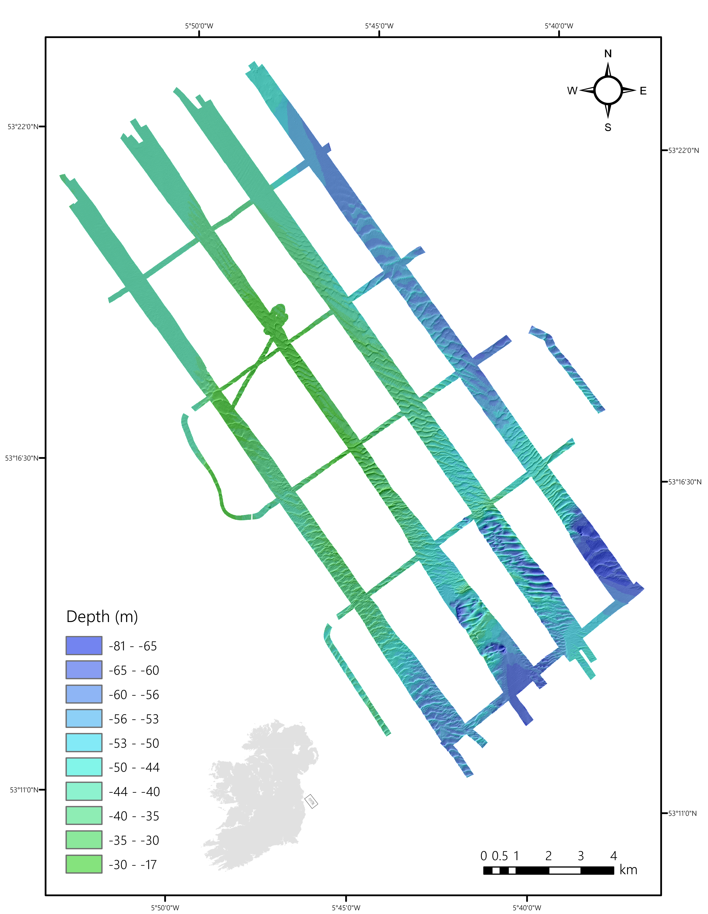
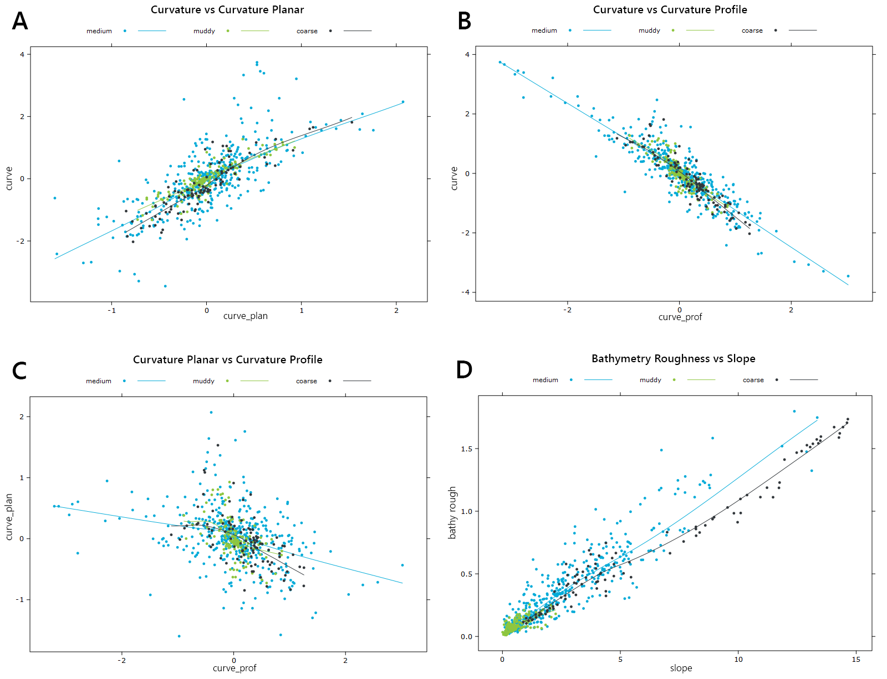
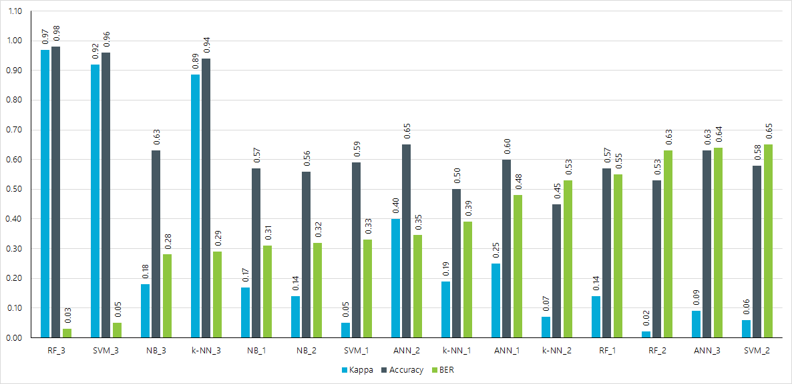

R script to test and compare five supervised classification algorithms for the purpose of predicting benthic substrate type using multibeam acoustic data and ground-truth samples. Feature selection processes are also tested in order to determine which combination of input features produces the most accurate results. The five classifiers examined include Support Vector Machine (SVM) Artificial Neural Network (ANN), k-Nearest Neighbour (k-NN), Random Forest (RF), and Naive Bayes (NB).

